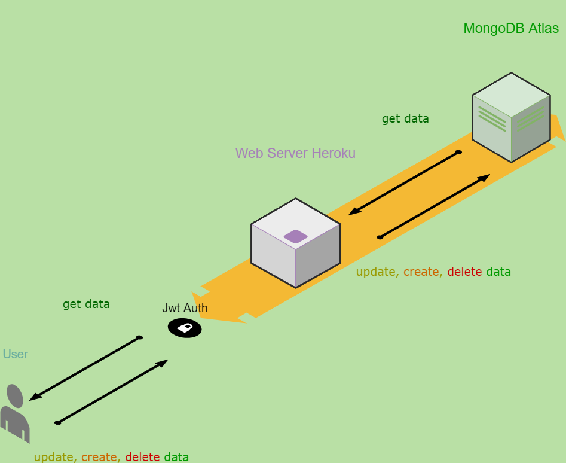

### Task App
With this app users can manage their tasks 

#### Requirments
Create dev.env and test.env file and add MongoDB url, sendgridemail ApiKEy, JWT secret word and PORT number
#### Run the app
Run: `npm install` and `npm run dev`
#### Test
`npm test` 
### Requests 
#### Install Postman for requests or you can use curl
This app runs on Heroku but in your computer url will be http://localshot:3000/
- Create user: Post `https://task-manager-restfull-api.herokuapp.com/users`
```
{
  "name": "example",
  "email": example@gmail.com"
  "password": "password"
}
```
- Login: Post `https://task-manager-restfull-api.herokuapp.com/users/login`
```
{
  "name": "example",
  "password": "password"
}
``` 
- Create task: Post `https://task-manager-restfull-api.herokuapp.com/tasks`
```
{
  "description": "fourth",
  "completed": false
}
```
- Update password or name: Patch `https://task-manager-restfull-api.herokuapp.com/users/me`
```
{
  "password": "123456@"
}
```
- Update task: Patch `https://task-manager-restfull-api.herokuapp.com/tasks/:id`
```
{
  "completed": true
}
```
- Delete user: Delete `https://task-manager-restfull-api.herokuapp.com/users/me`
- Delete task: Delete `https://task-manager-restfull-api.herokuapp.com/tasks/:id`
- Delete picture: Delete `https://task-manager-restfull-api.herokuapp.com/users/me/avatar`
- Get profile: Get `https://task-manager-restfull-api.herokuapp.com/users/me`
- Get user tasks: Get `https://task-manager-restfull-api.herokuapp.com/tasks?sortBy=createdAt:asc`
- Get user's single task with id: `https://task-manager-restfull-api.herokuapp.com/tasks/:id`
- Get user's picture: `https://task-manager-restfull-api.herokuapp.com/users/:id/avatar`
- Upload profile picture: Post `https://task-manager-restfull-api.herokuapp.com/users/me/avatar`
- Logout: Post `https://task-manager-restfull-api.herokuapp.com/users/logout`
- Logoutall: Post `https://task-manager-restfull-api.herokuapp.com/users/logoutAll`

